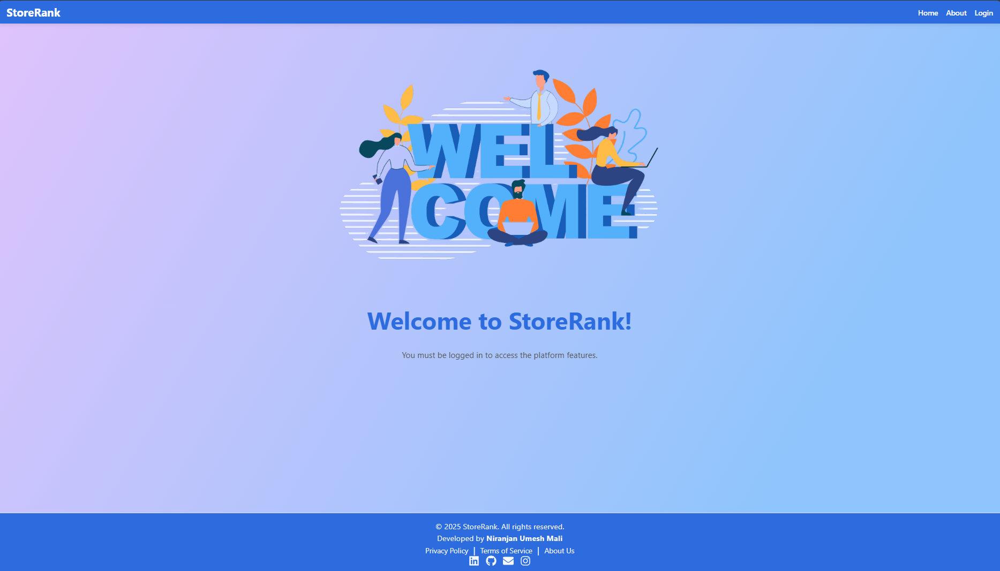
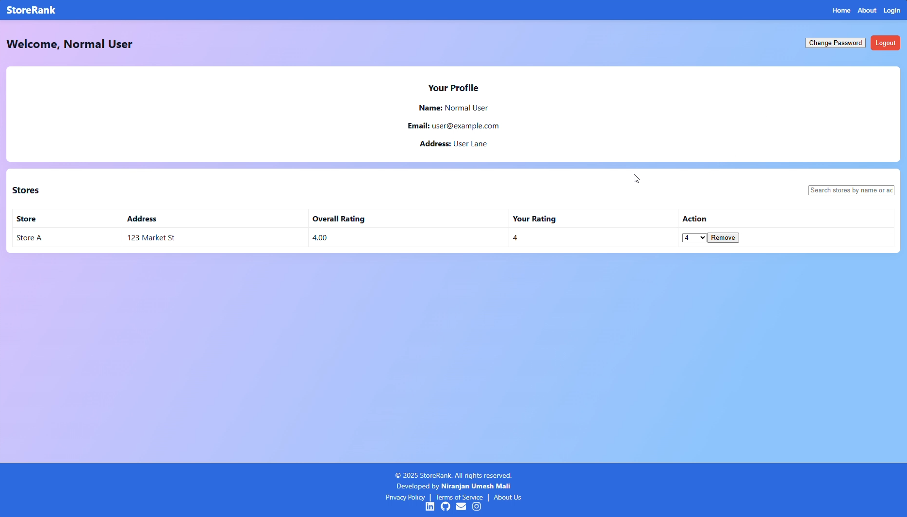

# 🏬 Store Rating App  

A **full-stack web application** where users can register, log in, and submit ratings for stores. The app supports **role-based access** for **System Administrators**, **Store Owners**, and **Normal Users**.  

This project was built as part of a **FullStack Coding Challenge**.  

---

## 📸 Screenshots  

_Add your screenshots here (examples below):_

- **Landing Page**  
    

- **Normal User – Store Listing**  
    

---

## 🚀 Tech Stack  

- **Frontend:** React.js (Create React App)  
- **Backend:** Node.js + Express.js  
- **Database:** PostgreSQL  
- **Authentication:** JWT (JSON Web Tokens)  
- **Hosting:** Render / Vercel / Local  

---

## 👥 User Roles & Features  

### 🔑 System Administrator  
- Add new **stores**, **normal users**, and **admin users**  
- Dashboard:  
  - Total users  
  - Total stores  
  - Total ratings  
- View and filter lists of:  
  - Stores (Name, Email, Address, Rating)  
  - Users (Name, Email, Address, Role)  
- View details of all users  
  - If user is a **Store Owner**, their rating details are shown  
- Logout functionality  

### 👤 Normal User  
- Sign up and log in  
- Update password after logging in  
- Browse all registered stores  
- Search stores by name or address  
- Store listing shows:  
  - Store name, address, overall rating, and user’s own rating  
- Submit or update rating (1–5)  
- Logout functionality  

### 🏪 Store Owner  
- Log in to the platform  
- Update password  
- Dashboard:  
  - List of users who rated their store  
  - Average rating of their store  
- Logout functionality  

---

## 🛠️ Installation & Setup  

### 1️⃣ Clone the repository  
git clone https://github.com/Mali-Niranjan/store-rating-app.git
cd store-rating-app

### 2️⃣ Backend Setup
cd backend
npm install

Create a .env file inside backend/:
PORT=5000
DATABASE_URL=your_postgres_connection_string
JWT_SECRET=your_jwt_secret

Run backend:
npm run dev

### 3️⃣ Frontend Setup
cd frontend
npm install

Start frontend:
npm start

By default:

Frontend → http://localhost:3000

Backend → http://localhost:5000

---

###🗄️ Database Schema

Users Table

| Field    | Type   | Notes                      |
| -------- | ------ | -------------------------- |
| id       | int PK | Unique identifier          |
| name     | string | 20–60 chars                |
| email    | string | Unique                     |
| password | string | Hashed                     |
| address  | string | ≤ 400 chars                |
| role     | enum   | `admin` / `user` / `owner` |

Stores Table

| Field   | Type   | Notes             |
| ------- | ------ | ----------------- |
| id      | int PK | Unique identifier |
| name    | string | Store name        |
| email   | string | Store contact     |
| address | string | Store address     |

Ratings Table

| Field   | Type   | Notes                  |
| ------- | ------ | ---------------------- |
| id      | int PK | Unique identifier      |
| userId  | FK     | References `Users.id`  |
| storeId | FK     | References `Stores.id` |
| rating  | int    | Range 1–5              |

---

### 🔗 API Endpoints (High-level)

Authentication

- POST /api/auth/signup → Register user
- POST /api/auth/login → Login user

Users

- GET /api/users → List users (Admin only)
- PUT /api/users/:id/password → Update password

Stores

- GET /api/stores → List all stores
- POST /api/stores → Add store (Admin only)

Ratings

- POST /api/ratings → Submit rating
- PUT /api/ratings/:id → Update rating

---

### ✅ Validations

- Name: 20–60 characters
- Address: Max 400 characters
- Password: 8–16 characters, must include at least one uppercase letter and one special character
- Email: Must follow valid email format

---

### 📄 License
This project is licensed under the MIT License.
